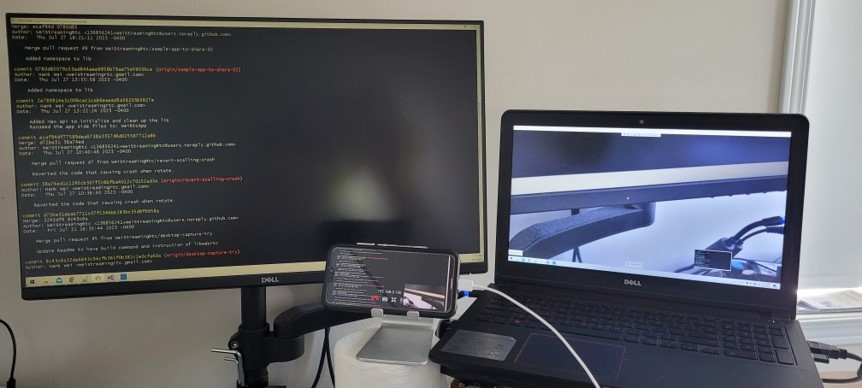

## About this repo

This is a sample app to demostrate windows native webrtc libs from WeiStreaming: WeiStreaming.WeiRtc.Native.lib.

It can establish a webrtc call with Google AppRtc Android demo app.

It can stream from camera or desktop capturer.

It has a built-in simple signaling server using direct TCP. When started, it runs as a TCP server listening at port 8888.

### Structure of this repo

1. *libwebrtc* folder: this folder holds all the WebRtc header files and binary: webrtc.lib.
2. *libweirtc* folder: this folder holds all the windows native WeiRtc header files and binary: WeiStreaming.WeiRtc.Native.lib.
3. *android-weirtc-patch.patch*: this is a patch that needs to be applied to Android AppRTCDemo app, see instructions below.
4. *WeiRtcSampleApp*: this folder holds the sample code to demonstrate the APIs of WeiRtc: WeiStreaming.WeiRtc.Native.lib.
## Requirement for running the sample App.

1. Visual Studio 2019 Version 16.6.2 or later.
2. At least 8GB of RAM (16GB of RAM is recommended).
3. At least 15GB of disk space.
4. Windows x64 and 10 above
5. Two displays in order to better demonstrate the desktop capture feature

## Build and Install Android AppRtc demo app

Download and build Google AppRtc Android demo app: https://github.com/njovy/AppRTCDemo

You can also build it from webrtc open source project: https://chromium.googlesource.com/external/webrtc/stable/talk/+/33ff0831ca67eeb4e33cfb4e0a0b68c6cc631ccc/examples/android/

You need to apply patches: android-weirtc-patch.patch. Copy android-weirtc-patch.patch to the root of Android AppRtc demo app code, then run following command.

```
 git am android-weirtc-patch.patch
```

Install on your device, and when started, type in your windows box's IP address that is running this demo app.

Go to Settings to give this app permission for camera and mic.

## Current Status

1. Capable of screen and camera capture
2. When testing desktop capture, make the following change in file: WeiRtcApp.cpp. Note, you must have at least two displays, lib is hardcoded (for this beta version) to share the second display in order to demonstrate more clearly.

```
    _sample->AddVideoTrack(pipCanvas);
    //Uncomment this line below and comment out the line above to test desktop capture.
    //_sample->AddDesktopTrack(*_screenPipCanvas);
```

Following pic is showing that windows side is doing screen share, android side is doing back facing camera.


## Next steps

1. Tear down.
2. Add more track to existing connection.
3. Mesh call.

## About WeiStreaming

With solid 5 years track record of constructing intricate WebRTC end-to-end video conferencing platforms, our mission is to provide afforable and easy to use WebRtc native SDKs for all popular platforms. So any native app can add WebRtc video conferencing features with minum cost.

weistreamingrtc@gmail.com  


